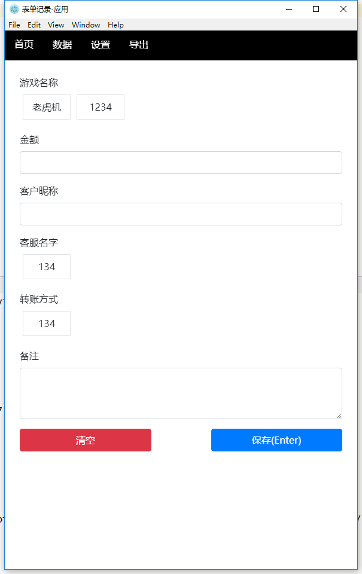
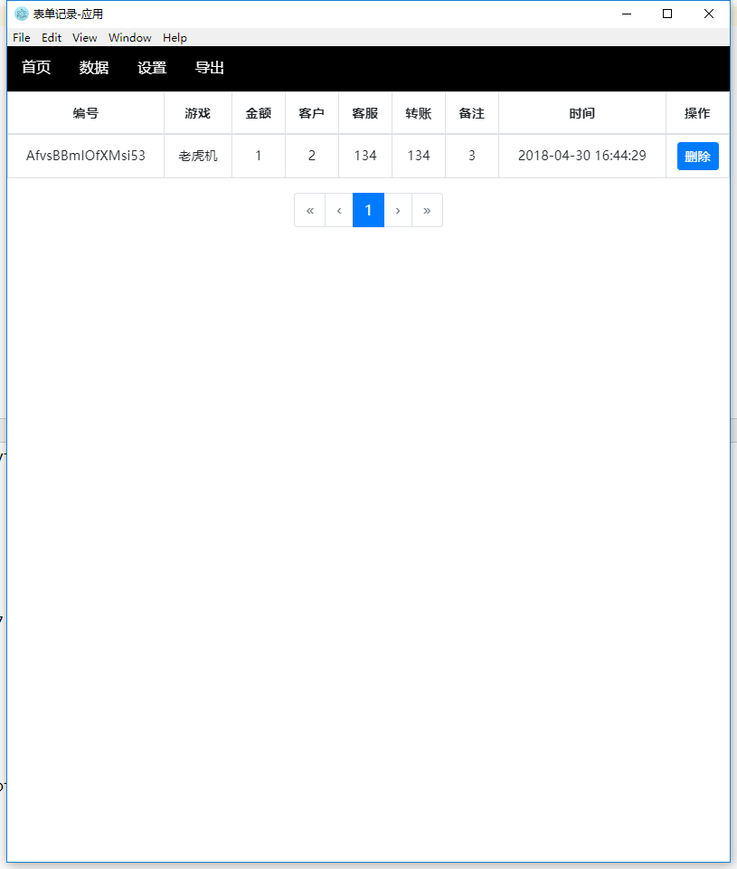
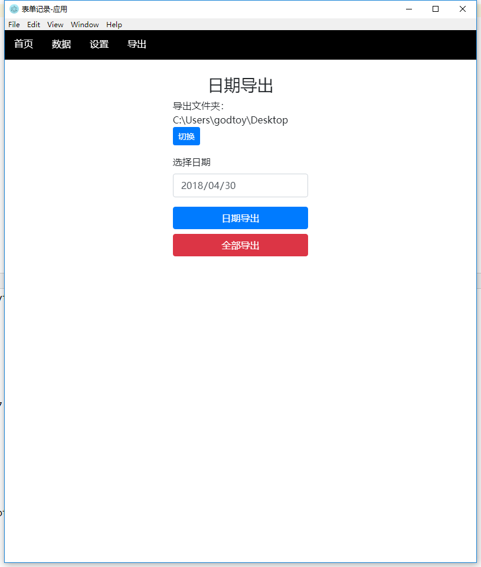

# form-project-nedb

> 一个使用 electron-vue nedb的尝试表单例子

api包括： rpcMain rpcRender file  app  window  dialog


## 截图






#### Build Setup

``` bash
# install dependencies
npm install

# serve with hot reload at localhost:9080
npm run dev

# build electron application for production
npm run build

# run unit & end-to-end tests
npm test

